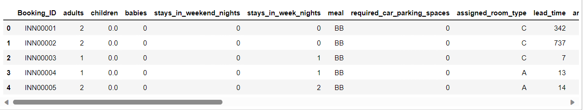

## Hotel-Booking-Dataset-mlflow-dvc

The online hotel reservation channels have dramatically changed booking possibilities and customers’ behavior. A significant number of hotel reservations are called-off due to cancellations or no-shows. The typical reasons for cancellations include change of plans, scheduling conflicts, etc. This is often made easier by the option to do so free of charge or preferably at a low cost which is beneficial to hotel guests but it is a less desirable and possibly revenue-diminishing factor for hotels to deal with.

Basically This is classification problem to predict if the customer is going to honor the reservation or cancel it. 

## Dataset

- Dataset Name: Hotel Booking Dataset
- Number of Records: 119,390
- Time Period: July 1, 2015, to August 31, 2017
- Data Source: https://www.kaggle.com/datasets/mojtaba142/hotel-booking

## Use Case:

This dataset can be used for various purposes, including but not limited to:

- Analyzing booking trends over time.
- Predicting hotel booking cancellations.
- Understanding customer behavior and preferences.

## Approach
~~~
1. Data Exploration     : I started exploring dataset using pandas,numpy,matplotlib and seaborn. 

2. Data visualization   : Ploted graphs to get insights about dependend and independed variables. 

3. Feature Engineering  :  All The Value Are Arrange In One Range.

4. Model Selection I    :  Tested all base models to check the base accuracy.
                       
5. Model Selection II   :  Performed Hyperparameter tuning using gridsearchCV.

6. Pickle File          :  Selected model as per best accuracy and created pickle file.

7. Documentation        :  Created detailed document of the entire project, including data sources, preprocessing steps, model details, and results.
~~~


# Project Demo
Below providing the link of all the document that are required for creating the project
Link: [Document link](https://deepakthakur-92/github.io/Hotel-Booking-Dataset-mlflow-dvc/)

### Dags hub Experiments- ML FLow
```
MLFLOW_TRACKING_URI=https://dagshub.com/deepak2009thakur/Hotel-Booking-Dataset-mlflow-dvc.mlflow \
MLFLOW_TRACKING_USERNAME=deepak2009thakur \
MLFLOW_TRACKING_PASSWORD=09a89198ee7cb39d44891d982e04cef1c388d58a \
python script.py
```


### Prediction Page


# Installation

To run my app on your local machine, do the following steps.

## Step 1 :

I have written the Code with Python 3.9.17. If you don't have Python installed you can find it here.
If you are using a lower version of Python you can upgrade using the pip package, kindly ensure that you have the latest version of pip.

## Step 2 :

If you want the current version of my repository to be in your github, you can do forking my repository visiting https://github.com/deepakthakur-92/Hotel-Booking-Dataset-mlflow-dvc.git

Clone my repository to your local machine by running the following command. Before doing this, you have to install git on your machine and make sure you are having proper internet connection.

For Windows OS user, open git bash and run the following command.

git clone https://github.com/deepakthakur-92/Hotel-Booking-Dataset-mlflow-dvc.git

For Linus OS user, open Terminal and run the following command.

git clone https://github.com/deepakthakur-92/Hotel-Booking-Dataset-mlflow-dvc.git

If you don't want to mess up with all these things, you can just download the zip file of my GitHub repository by clicking here and extract it to any file location as your wish and then use it.

Now we have done with the downloading of my whole project.

## Step 3 :

After downloading the whole repo, get into the main folder by hit the following command in git bash for Windows OS users and Terminal for Linux OS users.

cd Hotel-Booking-Dataset-mlflow-dvc

## Step 4 :

Now we are going to install all the dependency libraries for this project. Before that you must have Python 3.9.17 and latest version of pip.

To install all the dependency libraries in a single command, run the following command.

pip install -r requirements.txt

## Step 5 :

After installing all the dependency libraries, you are ready to run my app on your local machine.

To launch my app on your local machine, hit the following command.

python app.py

## Run

Now you have successfully launched my app on your local machine.

To view my app, hit the following URL in any of the browser such as Chrome, FireFox, etc..,

## http://127.0.0.1:5000 - For welcome page

## http://127.0.0.1:5000/predictdata - for prediction site


# Contributer
- Deepak Thakur