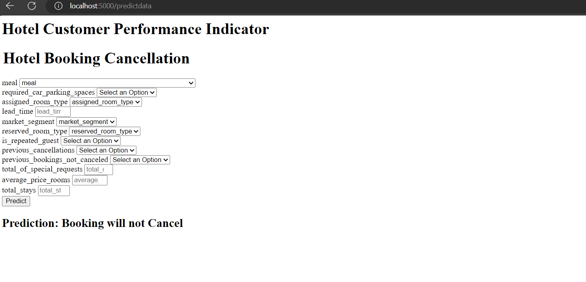

# Data Ingestion in a Flask Web Application

## Introduction

This document discusses the data ingestion process within a Flask web application for making predictions using a trained machine learning model. The application takes user inputs, preprocesses the data, and provides predictions. The relevant components are as follows:

- **Flask**: A web framework for building web applications in Python.

- **CustomData**: A class representing user input data for predictions.

- **PredictPipeline**: A class responsible for loading the trained model, loading a preprocessing object, and making predictions.

## Data Ingestion Steps

### 1. User Input

- The Flask application has a form that allows users to input various features required for making predictions, such as meal type, lead time, and more.

- When the user submits the form, the entered data is collected as HTTP POST requests.

### 2. Data Creation

- The user input data is collected as key-value pairs and used to create a `CustomData` object, encapsulating the input data.

### 3. Data Transformation

- The `CustomData` object is used to create a DataFrame that matches the structure used during model training. This DataFrame includes the user-provided input data.

### 4. Prediction

- The Flask application utilizes the `PredictPipeline` to make predictions based on the user's input data.

- The `PredictPipeline` loads the trained model and a preprocessing object.

- The user's input data is preprocessed using the loaded preprocessing object.

- The preprocessed data is then passed through the trained model, which returns predictions.

- The prediction result is a label indicating whether the booking will be canceled or not, and it is displayed to the user.

## Usage

To use the Flask web application for making predictions, follow these steps:

1. Start the Flask application by running the script.

2. Access the home page by visiting the application's URL.

3. Fill out the form with the required input features.

4. Submit the form to get a prediction result.

5. The result will be displayed on the web page, indicating whether the booking is expected to be canceled or not.

## Conclusion

The data ingestion process in the Flask web application involves collecting user input, transforming it into the required format, and using a trained machine learning model to make predictions. This document provides an overview of the data ingestion steps within the context of the web application.

This document offers insights into the data ingestion process within a Flask web application, facilitating a better understanding of how user input is collected and processed for making predictions.

