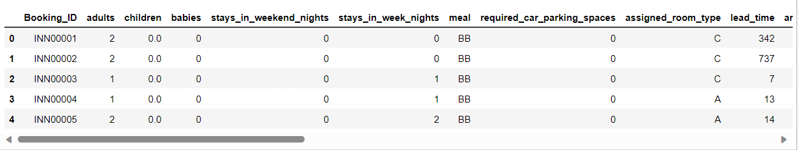
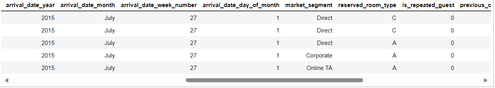
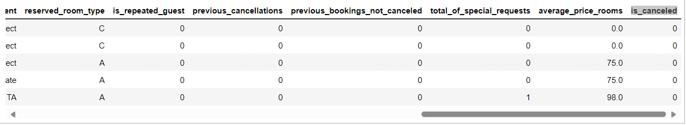

## Hotel Booking Dataset

The online hotel reservation channels have dramatically changed booking possibilities and customers’ behavior. A significant number of hotel reservations are called-off due to cancellations or no-shows. The typical reasons for cancellations include change of plans, scheduling conflicts, etc. This is often made easier by the option to do so free of charge or preferably at a low cost which is beneficial to hotel guests but it is a less desirable and possibly revenue-diminishing factor for hotels to deal with.

**Data Description:**

- Dataset Name: Hotel Booking Dataset
- Number of Records: 119,390
- Time Period: July 1, 2015, to August 31, 2017
- Data Source: https://www.kaggle.com/datasets/mojtaba142/hotel-booking

**Attributes:**

- Booking_ID: Unique booking ID
- adults: Number of adults
- children: Number of children
- babies: Number of babies
- stays_in_weekend_nights: Number of weekend nights (Saturday or Sunday) the guest stayed or booked to stay at the hotel
- stays_in_week_nights: Number of week nights (Monday to Friday) the guest stayed or booked to stay at the hotel
- meal: Type of meal booked. Categories are presented in standard hospitality meal packages:	
        Undefined/SC – no meal package;
        BB – Bed & Breakfast;
        HB – Half board (breakfast and one other meal – usually dinner);
        FB – Full board (breakfast, lunch and dinner)
- required_car_parking_spaces: Number of car parking spaces required by the customer
- assigned_room_type: Code for the type of room assigned to the booking. Sometimes the assigned room type differs from the      reserved room type due to hotel operation reasons (e.g. overbooking) or by customer request. Code is presented instead of designation for anonymity reasons
- lead_time: Number of days that elapsed between the entering date of the booking into the PMS and the arrival date
- arrival_date_year: Year of arrival date
- arrival_date_month: Month of arrival date with 12 categories: “January” to “December”
- arrival_date_week_number: Week number of the arrival date
- arrival_date_day_of_month: Day of the month of the arrival date
- market_segment: Market segment designation. In categories, the term “TA” means “Travel Agents” and “TO” means “Tour Operators”
- reserved_room_type: Code of room type reserved. Code is presented instead of designation for anonymity reasons
- is_repeated_guest: Value indicating if the booking name was from a repeated guest (1) or not (0)
- previous_cancellations: Number of previous bookings that were cancelled by the customer prior to the current booking
- previous_bookings_not_canceled: Number of previous bookings not cancelled by the customer prior to the current booking
- total_of_special_requests: Number of special requests made by the customer (e.g. twin bed or high floor)
- average_price_rooms: average_price_rooms
- is_canceled: Value indicating if the booking was canceled (1) or not (0)

**Use Case:**

This dataset can be used for various purposes, including but not limited to:

- Analyzing booking trends over time.
- Predicting hotel booking cancellations.
- Understanding customer behavior and preferences.

**Data Preview:**

